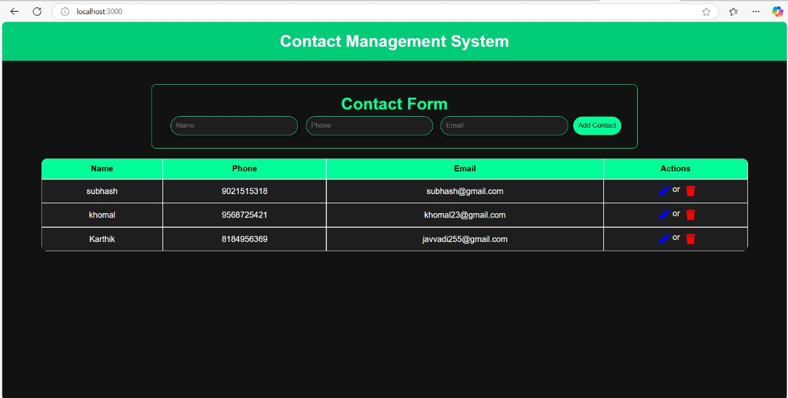
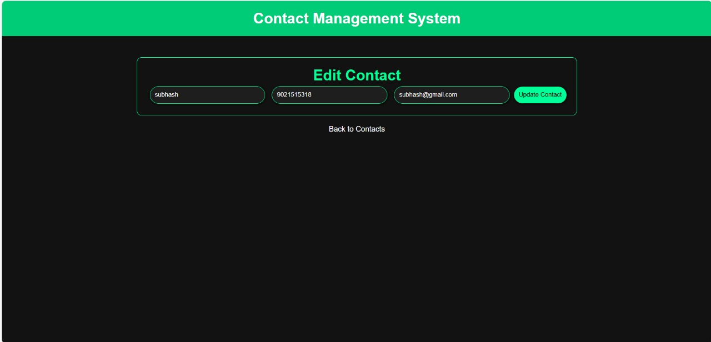

# Contact Management System

This is a simple web application that helps you manage your contacts. You can easily add, update, view, and delete contact details. The app is built using Node.js, Express.js, EJS, and MongoDB, making it a lightweight yet powerful tool for contact management.

## Features

- **Add Contacts**: Quickly add new contacts by entering details like name, phone number, and email.
- **View Contacts**: See all your saved contacts in a clean, easy-to-read table.
- **Update Contacts**: Edit any contact's information whenever you need to.
- **Delete Contacts**: Remove any contact from the list when it’s no longer needed.
- **User-friendly Interface**: The app has a simple and responsive design, with buttons for easy editing and deleting.

## Technology Stack

- **Frontend**: Built with HTML, CSS, JavaScript, and EJS (Embedded JavaScript) for rendering views.
- **Backend**: Powered by Node.js and Express.js for handling the server and routing.
- **Database**: MongoDB (with MongoDB Compass for managing the database locally).
- **Icons**: FontAwesome for icons.

## Screenshots

- **Home Page**: The main page where you can add new contacts and see your current contacts in a table format.

- **Edit Contact Page**: The page where you can modify the details of an existing contact.

## Conclusion

The Contact Management System is a simple and practical web app for keeping your contacts organized. It shows how combining Node.js, Express.js, EJS, and MongoDB can help you build a functional and easy-to-use tool for managing your contacts efficiently.
